<div align="center">
  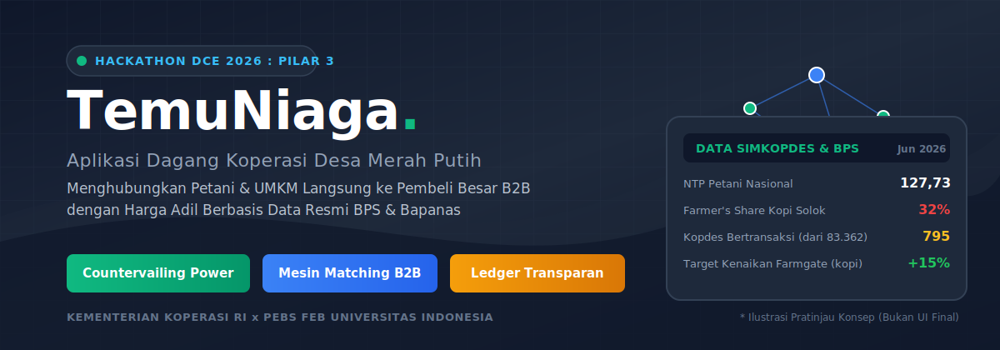

  <h3>Aplikasi Dagang Koperasi Desa Merah Putih</h3>
  <p><em>Menghubungkan Petani dan UMKM Langsung ke Pembeli Besar B2B dengan Harga Adil Berbasis Data Resmi</em></p>

  <p>
    <a href="https://hackathon.simkopdes.go.id"></a>
    
    
  </p>
  <p>
    
    
    
    
  </p>
</div>

---

## Daftar Isi

- [BAGIAN 1](#bagian-1)
  - [PITCH DECK & STRATEGI BISNIS](#pitch-deck--strategi-bisnis)
  - [Ringkasan Eksekutif](#ringkasan-eksekutif)
  - [Diagnosis Masalah (Lensa Ekonomi)](#diagnosis-masalah-lensa-ekonomi)
  - [Solusi Ekonomi: Koperasi sebagai Countervailing Power](#solusi-ekonomi-koperasi-sebagai-countervailing-power)
  - [Kuantifikasi Pemangkasan Rantai (Worked Example Beras vs Kopi)](#kuantifikasi-pemangkasan-rantai-worked-example-beras-vs-kopi)
  - [Kompatibilitas Insentif & Tiga Pasak Tata Kelola](#kompatibilitas-insentif--tiga-pasak-tata-kelola)
  - [Alur Operasional & Spektrum Mode Penyerapan](#alur-operasional--spektrum-mode-penyerapan)
  - [Eksplorasi Antarmuka & Mockup Interaktif](#eksplorasi-antarmuka--mockup-interaktif)
- [BAGIAN 2: LAMPIRAN TEKNIS, ARSITEKTUR & REGULASI](#bagian-2-lampiran-teknis-arsitektur--regulasi)
  - [Detail Algoritma B: Mesin Harga Acuan Transparan](#detail-algoritma-b-mesin-harga-acuan-transparan)
  - [Detail Algoritma A: Pencocokan Stok dan RFQ Pembeli](#detail-algoritma-a-pencocokan-stok-dan-rfq-pembeli)
  - [Arsitektur Teknis Sistem](#arsitektur-teknis-sistem)
  - [Matriks Analisis Risiko & Penanggulangan (R1–R12)](#matriks-analisis-risiko--penanggulangan-r1r12)
  - [Posisi Terhadap Simkopdes & Model Keberlanjutan Finansial](#posisi-terhadap-simkopdes--model-keberlanjutan-finansial)
  - [Daftar Sumber Terverifikasi & Teori Ekonomi](#daftar-sumber-terverifikasi--teori-ekonomi)
- [BAGIAN 3: MENTORSHIP ADDITIONS — Data, Pitch & Strategy](#bagian-3-mentorship-additions--data-pitch--strategy)
  - [A. Jurang Terdaftar vs Hidup (Data SimkopDes Juni 2026)](#a-jurang-terdaftar-vs-hidup-data-simkopdes-juni-2026)
  - [B. Kriteria Juri & Format Pitch](#b-kriteria-juri--format-pitch)
  - [C. TAM · SAM · SOM](#c-tam--sam--som)
  - [D. Value Proposition Canvas](#d-value-proposition-canvas)
  - [E. Asisten AI: RAG Scoped + Voice Bot](#e-asisten-ai-rag-scoped--voice-bot)
  - [F. Model Bisnis Produk](#f-model-bisnis-produk)
  - [G. Empat Analisis PEBS FEB UI](#g-empat-analisis-pebs-feb-ui)
  - [H. Benchmark Global](#h-benchmark-global)
  - [I. Empat Jebakan Klasik (dan jawaban TemuNiaga)](#i-empat-jebakan-klasik-dan-jawaban-temuniaga)
  - [J. Indikator Dampak 4 Dimensi](#j-indikator-dampak-4-dimensi)
  - [K. Visi Ekosistem Data Nasional](#k-visi-ekosistem-data-nasional)
  - [L. Struktur Pitch Deck Final (11 Slide)](#l-struktur-pitch-deck-final-11-slide)
  - [M. Catatan Sejarah KUD & Pelajaran](#m-catatan-sejarah-kud--pelajaran)

---

## BAGIAN 1

### PITCH DECK & STRATEGI BISNIS

#### Ringkasan Eksekutif

> [!IMPORTANT]
> **Pemerintah membentuk 80.000 Koperasi Desa/Kelurahan Merah Putih (Inpres 9/2025) dan menugaskan mereka menyerap hasil panen, menekan tengkulak, serta memperpendek rantai pasok.** Namun, sebagian besar koperasi belum dibekali mesin ekonomi operasional. Bagaimana cara koperasi menetapkan harga adil, menemukan pembeli besar, dan menjaga kepercayaan anggota agar terhindar dari keruntuhan?

> [!NOTE]
> **TemuNiaga adalah mesin ekonomi yang mengisi celah operasional tersebut.** Koperasi mengagregasi hasil tani dan produk UMKM dari banyak anggota, mengumpulkan volume hingga menembus batas Minimum Order Quantity (MOQ), lalu menjual langsung ke pembeli besar B2B di luar desa (pabrik, ritel modern, eksportir, Bulog, antar-Kopdes). Harga adil dibuktikan secara transparan melalui integrasi data resmi BPS dan Bapanas. Ledger yang transparan mencegah kecurangan pengurus yang menjadi penyebab utama runtuhnya koperasi di masa lalu.

> [!TIP]
> **Inti Mekanisme Ekonomi:** Koperasi menyamai keunggulan utama tengkulak (yaitu uang tunai cepat via dana talangan) tanpa memikul risiko inventori spekulatif (mempercepat skema buyer-first atau konsinyasi). Petani berkedudukan sebagai residual claimant (penjual = pemilik = penerima SHU), sehingga upaya koperasi mencari surplus dan membayar harga adil di tingkat farmgate tidak bertentangan, asalkan tiga pasak tata kelola ditegakkan dengan tegas.

---

### Diagnosis Masalah (Lensa Ekonomi)

<div align="center">
  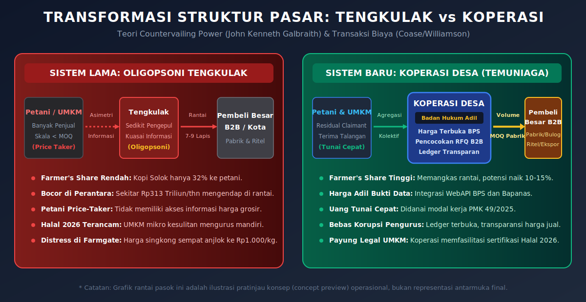
</div>

Masalah utama ekonomi desa bukanlah kurangnya produksi atau rendahnya kesejahteraan agregat secara mutlak. Data resmi mencatat Nilai Tukar Petani (NTP) nasional berada di angka 127,73 per Mei 2026 (di atas ekuilibrium 100). Masalah sesungguhnya terletak pada distribusi nilai di dalam rantai pasok (value distribution): berapa porsi harga akhir yang nyata sampai ke tangan produsen (farmer's share), dan bagaimana struktur pasar menekan harga di tingkat farmgate.

#### 6 Mekanisme Kegagalan Pasar di Sisi Penjualan

| Mekanisme Kegagalan Pasar | Penjelasan & Bukti Empiris | Landasan Teori Ekonomi |
| :--- | :--- | :--- |
| **1. Oligopsoni di Tingkat Farmgate** | Banyak petani (penjual) menghadapi segelintir pengepul (pembeli) di tingkat desa. Petani terjebak sebagai price-taker. Studi empiris komoditas cabai di Lampung Selatan mengonfirmasi pasar bersifat oligopsoni dengan daya tawar petani sangat lemah. | Struktur Pasar & Daya Tawar |
| **2. Farmer's Share Rendah di Rantai Panjang** | Bukti empiris menunjukkan porsi harga yang diterima petani bervariasi 32% sampai 89% tergantung panjang rantai. Kopi Solok hanya bernilai 32% (rantai panjang 7-9 lapis), sedangkan cabai rantai pendek mencapai 89%. Implikasi: memperpendek rantai = menaikkan farmer's share. | Margin Pemasaran & Rantai Nilai |
| **3. Asimetri Informasi** | Petani dan pelaku UMKM desa tidak mengetahui harga acuan riil di pasar grosir atau industri. Informasi dikuasai sepenuhnya oleh perantara yang meraup selisih besar. | George Akerlof (Market for Lemons) |
| **4. Skala Sub-Optimal & Gerbang MOQ** | Volume panen per individu terlalu kecil untuk memenuhi Minimum Order Quantity (MOQ) pembeli besar. Tanpa agregasi, petani secara struktural mustahil bertransaksi langsung dengan industri. | Economies of Scale |
| **5. Biaya Transaksi Tinggi** | Pencarian pembeli (search cost), negosiasi, logistik, dan legalitas sangat mahal bila ditanggung individu. Tengkulak eksis karena menyerap biaya ini, lalu menagihnya mahal lewat potongan harga beli. | Coase / Williamson (Transaction Cost Economics) |
| **6. Hambatan Formalitas UMKM** | Sekitar 64 juta UMKM (99,99% unit usaha) sulit menembus ritel modern/B2B karena ketiadaan badan hukum dan sertifikasi. Sertifikasi halal wajib penuh berlaku 18 Okt 2026, menjadi beban berat bagi usaha mikro jika tidak ditanggung kolektif. | Barrier to Entry |

#### Bukti Konkret Distress di Lapangan
- **Kasus Singkong**: Harga singkong sempat anjlok parah hingga Rp1.000/kg, memaksa pemerintah turun tangan menetapkan harga acuan Rp1.350/kg (berlaku 9 Sep 2025).
- **Estimasi Makro**: Kementerian Pertanian (4 Jun 2025) mengestimasi sekitar Rp313 triliun/tahun nilai ekonomi mengendap di perantara dengan margin 10% sampai 30%. Ini merupakan batas atas yang masih mencakup biaya riil logistik, giling, dan susut.
- **Ketimpangan Nilai Tambah**: Singkong mentah Rp1.350/kg diolah menjadi keripik bermerek seharga Rp30.000/kg (20 kali lipat). Nilai tambah ini menguap ke luar desa karena tiadanya jembatan pengolahan dan pemasaran kolektif.

---

### Solusi Ekonomi: Koperasi sebagai Countervailing Power

Mengacu pada teori John Kenneth Galbraith, solusi fundamentalnya adalah membangun Countervailing Power (Daya Tawar Pengimbang): mengubah struktur pasar dari oligopsoni tengkulak menjadi daya tawar kolektif melalui badan hukum koperasi yang adil.

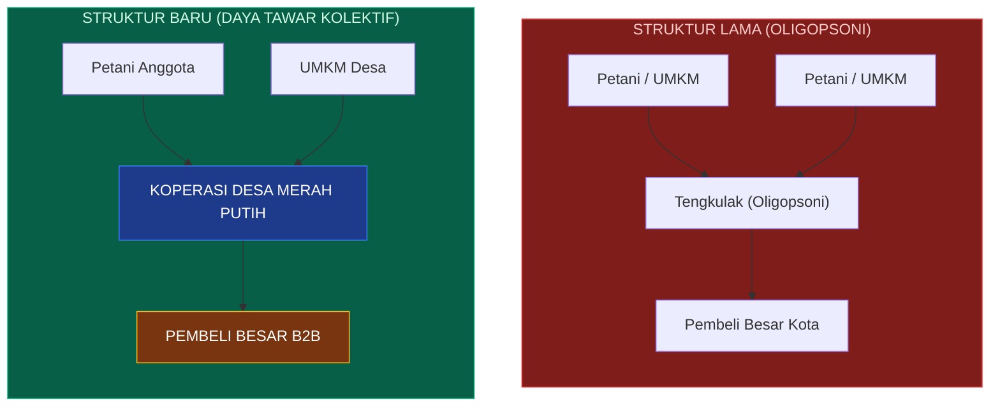

#### 3 Transformasi Ekonomi Koperasi:
1. **Menginternalisasi Margin Perantara**: Keuntungan yang dulu diserap tengkulak kini menjadi surplus koperasi, yang dibagikan kembali kepada anggota melalui Sisa Hasil Usaha (SHU) secara adil.
2. **Memangkas Asimetri Informasi**: Menyediakan mesin harga acuan transparan (mengambil data resmi BPS dan Bapanas) langsung di genggaman petani dan operator.
3. **Menurunkan Biaya Transaksi**: Menerapkan digitalisasi agregasi, sistem Request for Quotation (RFQ), dan logistik terpadu.

> [!IMPORTANT]
> **Arah Pemasaran: KELUAR DESA (B2B), Bukan ke Dalam Desa (B2C).**  
> Menjual kembali komoditas ke sesama warga desa (B2C lokal) hanyalah model toko kelontong yang pasarnya sempit, cepat jenuh, dan tidak akan menaikkan harga di tingkat petani. TemuNiaga berfokus menghubungkan desa ke pasar nasional (B2B keluar): langsung ke pabrik pengolahan, ritel modern, eksportir, BUMN Pangan (Bulog), dan perdagangan antar-Kopdes (wilayah surplus ke defisit). Gerai B2C di desa diposisikan hanya sebagai pelengkap untuk menyerap produk Grade B atau surplus logistik.

---

### Kuantifikasi Pemangkasan Rantai (Worked Example Beras vs Kopi)

Berapa rupiah sebenarnya nilai yang bisa direbut kembali dengan memangkas rantai pasok? Jawaban kami transparan dan realistis, disesuaikan dengan karakteristik komoditas:

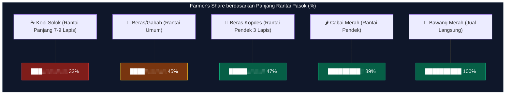

#### Worked Example: KOMODITAS BERAS (Data Aktual Mei 2026)
Rantai pasok beras saat ini memiliki 7 sampai 9 titik perantara (Petani -> Penggilingan -> Pengepul -> Bandar -> Grosir -> Pengecer -> Konsumen). Target Kopdes adalah memangkasnya menjadi kurang lebih 3 tahap.
- **Harga Gabah Kering Panen (GKP)** di petani: Rp6.925/kg.
- **Harga Beras Medium** di konsumen: Rp13.444/kg.
- **Rendemen GKP ke Beras**: Sekitar 63% (1 kg beras setara 1,59 kg GKP). Nilai keekonomian gabah dalam 1 kg beras bernilai Rp11.000.
- **Biaya Fisik Riil (Giling, Susut, Transport)**: Rp1.500/kg (biaya tetap yang tidak bisa dihilangkan).
- **Kue Margin Perantara yang Tersedia**: Rp13.444 - Rp11.000 - Rp1.500 = Rp944/kg (Hanya 7% dari harga konsumen).

| Komponen (Per kg Beras Medium) | Rantai Panjang Lama (7-9 Lapis) | Rantai Pendek Kopdes (3 Lapis) |
| :--- | :--- | :--- |
| **Nilai Aktual Diterima Petani** | Rp11.000 | **Rp11.350 (+3% Kenaikan Farmgate)** |
| **Biaya Riil (Giling + Susut + Transport)** | +Rp1.500 | +Rp1.500 (Tetap ada) |
| **Margin Pengepul / Bandar / Grosir** | +Rp944 | **Dipangkas Total** |
| **Margin Operasional Kopdes** | — | +Rp500 (Untuk servis bunga pinjaman 6% & SHU) |
| **Harga Beli Konsumen Akhir** | **Rp13.444** | **Rp13.350 (Turun 1%)** |

> [!WARNING]
> **Kejujuran Klaim & Pengungkapan Batas Realistis:**  
> Pada komoditas beras, dampak pemangkasan rantai tergolong kecil (sekitar 3% kenaikan harga petani) karena rantai tata niaga beras nasional sudah relatif efisien dan margin perantaranya tipis (7%).  
> Dampak besar dan signifikan justru terjadi pada komoditas rantai panjang dengan Farmer's Share rendah, seperti Kopi Solok (Farmer's Share 32%, artinya 68% nilai mengendap di perantara). Pada komoditas bernilai tinggi dan berdaya simpan lama seperti ini, pemangkasan rantai melalui TemuNiaga mampu mendongkrak harga di tingkat farmgate hingga +10% sampai +15%. Sebaliknya, pada komoditas hortikultura yang mudah busuk (perishable) atau di desa terpencil, dampaknya bisa mendekati 0% karena besarnya biaya susut dan logistik riil.

---

### Kompatibilitas Insentif & Tiga Pasak Tata Kelola

Pertanyaan kritis dari dewan juri: *"Jika Koperasi Desa dibebani bunga pinjaman 6% per tahun dan dituntut menghasilkan laba (SHU), mengapa pengurus mau membayar harga adil kepada petani? Bukankah lebih menguntungkan menekan harga beli di bawah pasar layaknya tengkulak?"*

#### Jawaban Teoretis: Koperasi Bukan Perseroan Terbatas (PT)
Di dalam PT, petani berkedudukan sebagai pemasok eksternal. Laba yang diperas dari petani mengalir kepada pemegang saham eksternal.  
Di dalam Koperasi, petani adalah Residual Claimant: Penjual = Pemilik = Penerima SHU. Jika pengurus membeli murah di tingkat farmgate, hal itu hanyalah memindahkan uang dari kantong kiri petani (sebagai penjual) ke kantong kanan petani yang sama (sebagai penerima SHU). Kesejahteraan anggota bersifat total (Harga Jual + SHU). Kehadiran koperasi juga menciptakan Yardstick Effect yang memaksa tengkulak di luar koperasi ikut menaikkan tawaran harga beli mereka (telah terbukti empiris pada koperasi kopi Chiapas, susu Eropa, dan gandum Kanada).

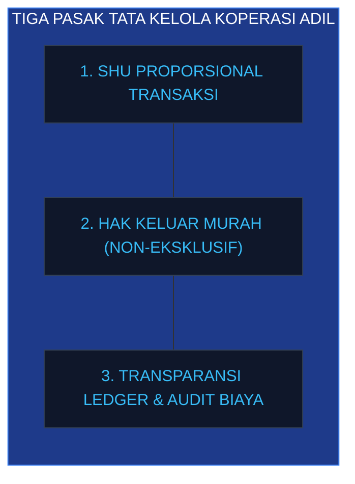

**Namun, prinsip di atas HANYA kokoh jika Tiga Pasak Tata Kelola ditegakkan secara absolut.** Tanpa ketiga pasak ini, Koperasi Desa hanya akan menjadi tengkulak berbadan hukum yang menggunakan modal pinjaman negara:
1. **SHU Dibagi Proporsional Berdasarkan Nilai Transaksi**: Pembagian laba harus didasarkan pada kontribusi nilai transaksi anggota (bukan per kepala atau ditahan pengurus), dikunci tegas dalam AD/ART.
2. **Hak Keluar Murah (Low Exit Cost) / Penjualan Non-Eksklusif**: Anggota bebas menjual ke tengkulak tanpa sanksi. Tengkulak sengaja dibiarkan hidup sebagai kompetitor pembanding (yardstick). Monopoli pembelian desa adalah desain terburuk karena mematikan yardstick dan menutup pintu keluar petani.
3. **Transparansi Ledger Real-Time & Audit Biaya Operasional**: Anggota dapat melihat langsung daftar harga jual lot dan potongan biaya operasional melalui aplikasi. Hal ini membongkar alibi pengurus yang kerap menekan harga petani dengan dalih membayar cicilan bank 6%, serta mencegah pembajakan oleh elit desa (elite capture).

---

### Alur Operasional & Spektrum Mode Penyerapan

Keunggulan utama tengkulak adalah memberikan uang tunai cepat kepada petani yang terdesak kebutuhan. Melalui TemuNiaga, koperasi menyamai kecepatan uang tunai tersebut tanpa harus memborong stok secara spekulatif. 

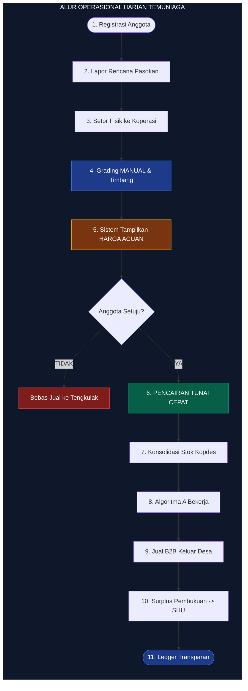

Kopdes dapat memilih 4 mode penyerapan berikut secara fleksibel berdasarkan karakteristik komoditas dan kondisi kas:

| Mode Penyerapan | Kondisi Penggunaan | Pihak Penanggung Risiko Jual | Skema Cash Cepat ke Petani |
| :--- | :--- | :--- | :--- |
| **a. Talangan via Simpan-Pinjam** | Kas Kopdes ketat / Komoditas mudah busuk (perishable) | **Petani** (Barang berstatus titipan/konsinyasi) | **DP / Dana Talangan Tunai** disalurkan via unit simpan-pinjam; sisa dilunasi saat terjual. |
| **b. Konsinyasi (Titip-Jual)** | Hortikultura, fluktuasi harga tinggi | **Petani** (Kopdes memungut fee jasa transparan) | **Pembayaran Sebagian** di muka; sisa ditransfer setelah lot laku di pasar B2B. |
| **c. Forward Dulu Baru Beli** | Permintaan (RFQ) dari pembeli besar telah terkunci | **Kopdes** (Risiko sangat rendah karena demand pasti) | **Pembayaran Penuh** (100% lunas) seketika saat serah terima fisik di gudang. |
| **d. Beli Putus Bayar di Muka** | Komoditas tahan lama (gabah/jagung) + Saluran jual B2B lancar | **Kopdes Penuh** (Risiko tinggi bila pasar anjlok) | **Pembayaran Penuh** (100% lunas) di muka saat penyerahan. |

> [!CAUTION]
> **Mengapa Mode Beli Putus Bukan Default Utama:**  
> Mode beli putus memindahkan seluruh risiko fluktuasi harga, susut fisik, dan likuiditas kepada Koperasi Desa yang modalnya berasal dari utang bank berbunga 6% per tahun (PMK 49/2025). Mengingat fasilitas cold storage mayoritas belum terbangun di 80.000 Kopdes, satu siklus harga anjlok atau panen membusuk di gudang akan memicu gagal bayar bank dan kebangkrutan koperasi.  
> Default aman operasional TemuNiaga adalah Mode (a), (b), dan (c) (Buyer-First / Talangan). Mode (d) hanya dibuka khusus untuk komoditas tahan lama (gabah/biji-bijian) yang jalur offtaker-nya sudah mapan.

---

### Eksplorasi Antarmuka & Mockup Interaktif

> [!NOTE]
> **STATUS MOCKUP: PRATINJAU KONSEP (CONCEPT PREVIEW)**  
> Seluruh gambar, mockup antarmuka (WhatsApp bot, voice bot, dashboard, portal B2B), dan diagram alur di dalam dokumen ini adalah **ilustrasi pratinjau konsep operasional (concept preview)** yang ditujukan untuk mendemonstrasikan logika bisnis di hadapan dewan juri, **bukan representasi tampilan antarmuka (UI) final**.

#### 1. WhatsApp Bot Bertombol (Anggota)
Antarmuka sadar-kondisi untuk petani dengan literasi digital rendah. Didukung menu interaktif bertombol (quick-reply) untuk mempercepat pelaporan pasokan dan pengecekan harga BPS.

<div align="center">
  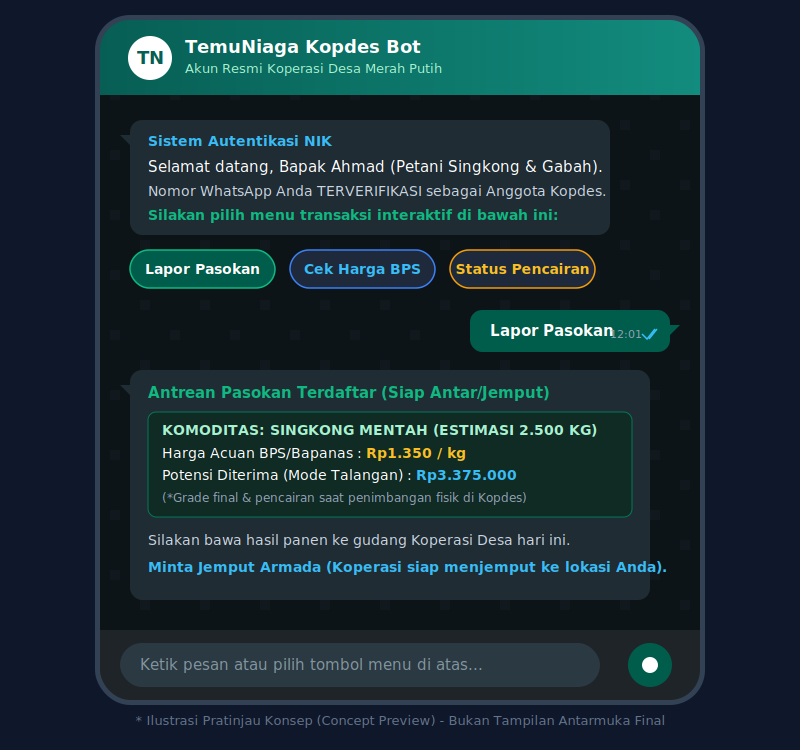
</div>

---

#### 2. Voice Bot (Petani Sangat Kuno)
Tak perlu baca, tak perlu tekan tombol. Cukup bicara — AI jawab berdasar data, near-zero halusinasi. STT → RAG → TTS. **Masuk MVP (live demo).**

<div align="center">
  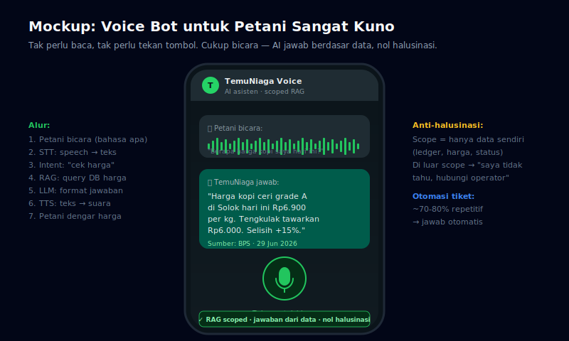
</div>

---

#### 3. Dashboard Web Operator Kopdes
Pusat komando operasional pengurus Kopdes. Menampilkan posisi kas dari pinjaman PMK 49/2025, tabel rekapitulasi grading manual di titik terima, serta status matching Algoritma A secara real-time.

<div align="center">
  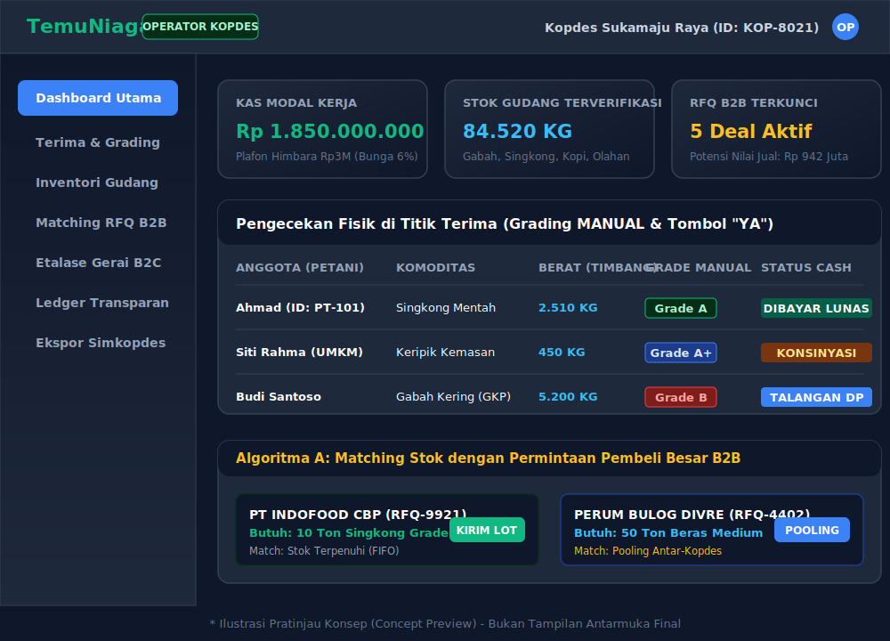
</div>

---

#### 4. Portal RFQ Pembeli Besar B2B
Pintu gerbang pembeli berskala industri (pabrik pengolahan, Bulog, ritel modern). Memfasilitasi pengajuan RFQ spesifik (komoditas, MOQ, grade), sistem pooling stok antar-koperasi, dan jaminan keamanan escrow Bank Himbara.

<div align="center">
  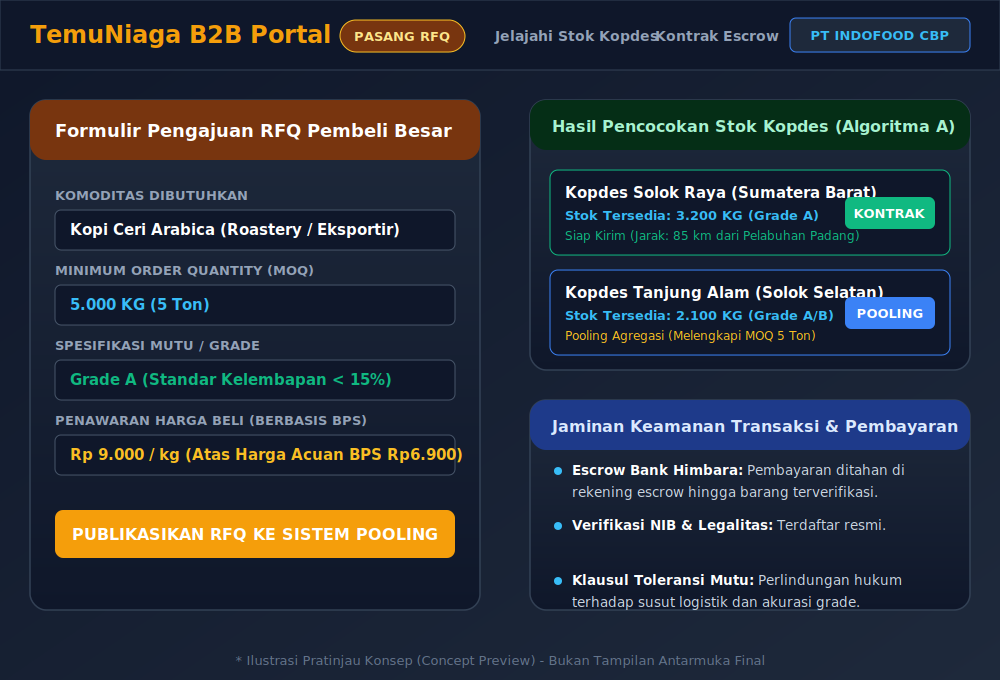
</div>

---
---

## BAGIAN 2: LAMPIRAN TEKNIS, ARSITEKTUR & REGULASI

Bagian ini memuat perincian teknis mendalam yang mendasari sistem TemuNiaga, ditujukan untuk pemeriksaan teknis, audit kode, dan kepatuhan regulasi.

### Detail Algoritma B: Mesin Harga Acuan Transparan

Sistem tidak mengarang harga, melainkan menerapkan hierarki sumber terverifikasi dengan prinsip Producer-Price-First:

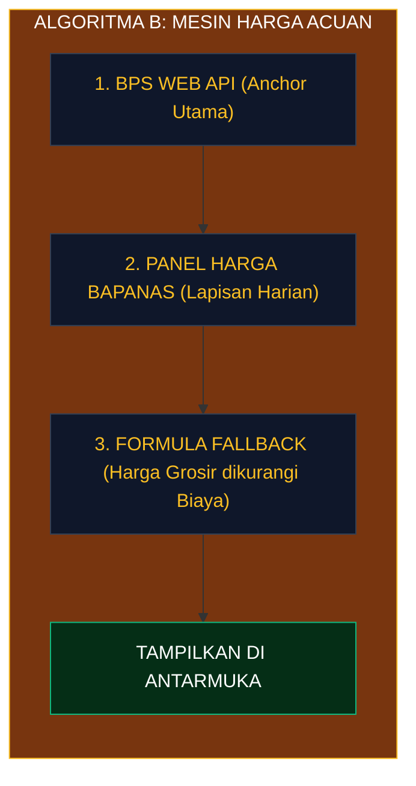

#### Verifikasi 4 Sumber Data Resmi:
1. **BPS (Harga Produsen Gabah & NTP)**: Anchor utama paling otoritatif. Memiliki landasan hukum kuat, metodologi ketat, dan satu-satunya yang menyediakan WebAPI pengembang resmi (`webapi.bps.go.id`). Kelemahan: bulanan, agregasi provinsi, dominan padi.
2. **Bapanas (Panel Harga Badan Pangan)**: Lapisan harian. Mencakup 514 kabupaten/kota secara harian (`panelharga.badanpangan.go.id`). Digunakan untuk menambal kebasian data BPS. Kelemahan: API tidak terdokumentasi resmi, teramati maintenance 25 Jun 2026 yang diatasi via Redis Cache lokal.
3. **PIHPS Bank Indonesia**: Basis data eceran harian 82 kota. Dipakai sekadar sebagai pembanding harga konsumen akhir.
4. **SP2KP Kemendag**: Basis data eceran/HET. Suplemen tambahan paling akhir.

#### Cacat Formula Fallback (Grosir dikurangi Biaya)
Jika data farmgate kosong, sistem terpaksa memakai rumus `Harga Grosir - (Biaya Logistik + Sortir + Margin)`. Kami tegaskan formula ini memiliki 3 cacat bawaan sehingga tidak dijadikan metode utama: (1) Double Counting Margin: Harga grosir sudah memuat margin pedagang kota; (2) Basis Regional: Perbedaan letak geografis kota konsumsi vs desa produksi memicu deviasi estimasi; (3) Mismatch Mutu: Harga grosir mewakili lot tersortir bersih, sedangkan panen farmgate masih basah atau kotor.

> [!NOTE]
> **AI Asisten RAG (Grounded Data, Nol Halusinasi):**  
> Sistem menyertakan asisten AI berbasis LLM + RAG (Retrieval-Augmented Generation) atas data sendiri (ledger, harga, status transaksi). AI hanya menjawab dari data aplikasi — bukan mengarang, bukan LLM free-form. Setiap jawaban bisa ditelusuri ke baris data. Modul ML time-series opsional untuk prakiraan tren 1–2 minggu. Detail di §Asisten AI.

---

### Detail Algoritma A: Pencocokan Stok dan RFQ Pembeli

Algoritma A bekerja di sisi hilir (Jual) untuk menemukan pembeli besar bagi stok yang telah dikuasai Koperasi.

```
+-------------------------------------------------------------------------------+
|                      ALGORITMA A: GREEDY MATCHING ENGINE                       |
+-------------------------------------------------------------------------------+
|  STOK KOPDES (T)    : { Lot_i, Komoditas, Qty_i, Grade_i, Lokasi_i, Masuk_i } |
|  RFQ PEMBELI (D)    : { Pembeli_j, Komoditas, MOQ_j, Spec_j, Harga_j, Tenggat }|
+-------------------------------------------------------------------------------+
|  UNTUK SETIAP PERMINTAAN (RFQ j):                                             |
|    1. Filter Kandidat : Komoditas Sama & Grade_i >= Spec_j & Radius Layak     |
|    2. Hitung Total    : SUM(Qty_i) dari seluruh lot kandidat                  |
|    3. Evaluasi MOQ    :                                                       |
|       +-- JIKA Total >= MOQ_j --> Bentuk Lot Jual (Prioritas: FIFO & Grade)   |
|       +-- JIKA Total <  MOQ_j --> Lakukan POOLING Stok Lintas-Kopdes          |
+-------------------------------------------------------------------------------+
```

- **Sistem Diferensiasi Mutu (Symmetrical Grading)**: Pembeli B2B bebas memilih grade sesuai kebutuhan industrinya. Pabrik makanan premium menyerap Grade A dengan harga tinggi, sedangkan pabrik saus atau pakan ternak menyerap Grade B/C dengan harga ekonomis. Tidak ada subsidi silang antar-mutu; setiap kualitas menemukan pembelinya sendiri.
- **Strategi Akuisisi Pembeli Besar**: Menggabungkan 3 jalur utama: (1) Portal RFQ Mandiri di aplikasi; (2) Offtake Broker / Kerjasama Induk (MoU kemitraan manual antara Koperasi Sekunder dengan pabrik besar atau Bulog, lalu order didistribusikan ke aplikasi); (3) Katalog Listing Etalase untuk produk olahan UMKM.

---

### Arsitektur Teknis Sistem

Sistem mengusung arsitektur Enterprise Modular yang terukur (scalable), tangguh terhadap kendala jaringan, namun tetap ringan untuk dieksekusi dalam tenggat hackathon 48 jam.

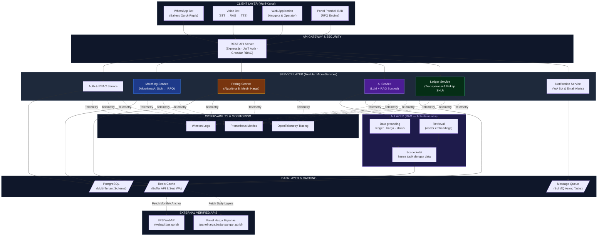

#### Prinsip Arsitektur Enterprise MVP:
- **Modular Micro-Services**: Layanan otentikasi, matching, harga, ledger, AI, dan notifikasi dipisah secara modular agar dapat diskalakan secara independen.
- **AI Service (RAG Scoped)**: LLM + Retrieval-Augmented Generation dengan grounding data sendiri (ledger, harga, status transaksi). Scope ketat — hanya menjawab topik yang punya data. Di luar scope → "hubungi operator". Setiap jawaban bisa ditelusuri ke baris data (near-zero halusinasi).
- **Voice Bot Pipeline**: STT → Intent Classification → RAG Query → LLM Format → TTS. Semua berbasis data, bukan free-form.
- **Granular RBAC**: Pemisahan hak akses tegas antara Petani, Operator Kopdes, Pengawas, dan Pembeli B2B.
- **Multi-Tenant Database**: Skema PostgreSQL didesain mendukung agregasi dan pooling stok antar-koperasi secara nasional.
- **Resilience via Caching**: Menggunakan Redis Cache untuk menyimpan data BPS/Bapanas, memastikan aplikasi tetap beroperasi lancar meskipun API pemerintah mengalami downtime atau pemeliharaan.
- **Asynchronous Message Queue**: Tugas berat seperti pengiriman notifikasi WhatsApp massal dan sinkronisasi data harga dijalankan di latar belakang melalui antrean pesan (message queue).

---

### Matriks Analisis Risiko & Penanggulangan (R1–R12)

Seluruh penanggulangan risiko di bawah ini tidak menciptakan beban baru, melainkan mengaktifkan unit usaha yang telah dimandatkan oleh Juknis Kemenkop (Unit Simpan Pinjam, Unit Cold Storage/Logistik) serta memanfaatkan transparansi ledger aplikasi.

| # | Identifikasi Risiko | Dampak Berbahaya | Strategi Penanggulangan (Mitigasi) |
| :--- | :--- | :--- | :--- |
| **R1** | **Side-Selling ke Tengkulak** | Pasokan bocor, volume gagal penuhi MOQ pembeli besar. | **Harga Adil + Cash Cepat (Talangan)** menyamai daya tarik tunai tengkulak; transparansi rekap **SHU proporsional transaksi**. Anggota tetap diizinkan menjual ke luar sebagai yardstick, mitigasi berbasis daya tarik harga, bukan paksaan hukum. |
| **R2** | **Grading Tidak Konsisten** | Lot pengiriman ditolak pembeli besar, reputasi hancur. | **Grading fisik manual terstandar** di titik terima (foto di app sekadar info awal); pelatihan intensif petugas Kopdes; klasifikasi skor reputasi anggota. |
| **R3** | **Gagal Memenuhi Batas MOQ** | Koperasi batal bertransaksi dengan industri/pabrik besar. | **Pooling pasokan lintas-Kopdes** via skema multi-tenant; penerapan pre-order farming dan fleksibilitas window pengiriman. |
| **R4** | **Risiko Fluktuasi Harga (Cobweb)** | Harga pasar anjlok tajam setelah Kopdes memborong stok panen. | **Default operasional Buyer-First / Konsinyasi**; penerapan forward contract di sisi pembeli hilir; penetapan harga dasar (floor price) konservatif; prioritas FIFO. |
| **R5** | **Data Harga Acuan Kosong/Basi** | Penentuan harga beli keliru, memicu ketidakpercayaan petani. | Arsitektur Producer-Price-First didukung Redis Cache; pencantuman tanggal pembaruan data secara real-time; pengaktifan formula fallback transparan. |
| **R6** | **Rendahnya Literasi Digital** | Petani enggan atau gagap mengoperasikan aplikasi. | Penyediaan antarmuka **WhatsApp Bot Bertombol (Quick-Reply)**; pengurus Kopdes berperan aktif sebagai operator pendamping (jembatan manusia). |
| **R7** | **Infrastruktur Desa Lemah** | Sinyal internet putus-putus atau pemadaman listrik mengganggu input. | Arsitektur toleran offline dengan antrean kirim lokal (offline queue buffer); antarmuka ringan; dukungan rekapitulasi batch. |
| **R8** | **Tata Kelola Lemah / Fraud Pengurus** | Margin disembunyikan, memicu keruntuhan kepercayaan anggota (Penyebab #1 KUD masa lalu runtuh). | **Ledger aplikasi transparan** (setiap anggota dapat melihat harga jual lot akhir & potongan operasional); pelibatan Pengawas independen; audit berkala. |
| **R9** | **Susut & Kerusakan Fisik (Perishable)** | Kerugian barang membusuk di gudang menjadi beban utang berbunga Kopdes. | **Prioritas MVP pada komoditas tahan lama** (gabah/biji-bijian); pemberlakuan skema konsinyasi untuk komoditas basah berisiko; percepatan perputaran via Gerai B2C lokal. |
| **R10** | **Krisis Modal Kerja (Cashflow)** | Kas Kopdes habis terpakai membayar petani sebelum pembeli melunasi pembayaran. | **Skema Talangan / Konsinyasi** agar kas tidak terkunci di stok telanjang; pemanfaatan fasilitas **Modal Kerja PMK 49/2025 (Plafon Rp3 Miliar)**; pemanfaatan rekening escrow. |
| **R11** | **Wanprestasi Pembeli B2B** | Koperasi menanggung kerugian besar akibat pembatalan sepihak pembeli. | Verifikasi ketat legalitas pembeli; kewajiban deposit uang muka (down payment) di rekening escrow Kopdes; klausul denda kontrak hukum. |
| **R12** | **Downtime API Pihak Ketiga** | Server BPS atau Bapanas down, melumpuhkan mesin harga acuan. | Penerapan **Redis Cache lokal**; multi-sumber API cadangan; fallback kalkulasi otomatis berbasis formula; penayangan stempel waktu data terakhir. |

---

### Posisi Terhadap Simkopdes & Model Keberlanjutan Finansial

#### Posisi Komplementer Terhadap Simkopdes
Berdasarkan penelusuran mendalam (25 Jun 2026), portal resmi Kementerian Koperasi Simkopdes (`simkopdes.go.id`) adalah portal pendaftaran dan monitoring non-transaksional. Laman resminya secara terbuka menyatakan platform tersebut berfungsi untuk registrasi kelembagaan online dan menayangkan dashboard statistik agregat, serta tidak menyediakan API publik untuk pembukuan transaksi pihak ketiga.

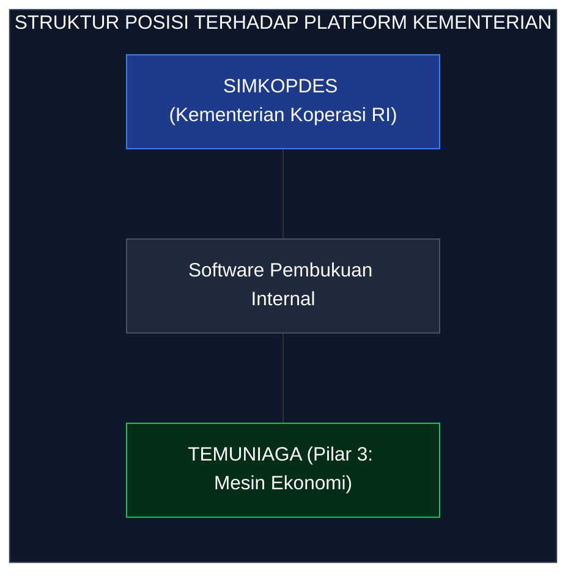

#### Implikasi Strategis Desain TemuNiaga:
- **Aplikasi Berdiri Sendiri (Stand-Alone)**: TemuNiaga memiliki ledger transaksi mandiri dan tidak bergantung pada sinkronisasi real-time ke Simkopdes (yang secara teknis mustahil dilakukan saat ini). Hal ini menepis kekhawatiran rumitnya sinkronisasi lintas-platform.
- **Simkopdes Compatible (Siap Ekspor Data)**: Data transaksi agregat (volume, akumulasi nilai, jumlah transaksi) dirancang agar mudah diekspor dalam format standar yang siap diunggah ke Simkopdes kapan pun Kemenkop membuka jalur pelaporan resmi.

---

#### Model Keberlanjutan Finansial (Sistem Utang PMK 49/2025)

**Realita Pembiayaan Koperasi Desa:**  
Berdasarkan regulasi PMK No. 49/2025, modal kerja Kopdes bersumber dari pinjaman bank Himbara dengan plafon maksimal Rp3 Miliar per koperasi, bunga pinjaman 6% per tahun, dan tenor cicilan 6 tahun (72 bulan). Pinjaman ini adalah utang murni, bukan hibah. Gaji manajer pengelola hanya ditanggung oleh BUMN (PT Agrinas) selama 2 tahun pertama; memasuki tahun ketiga, seluruh biaya operasional dan gaji manajer harus dibayar penuh dari kas/SHU koperasi itu sendiri.

```
+-------------------------------------------------------------------------------+
|                       PERSAMAAN RUANG MARGIN KOPDES                            |
+-------------------------------------------------------------------------------+
|  MARGIN KOPDES = Harga Jual B2B - Harga Beli Petani - Biaya Fisik Riil        |
|                  - Biaya Operasional/Software - Beban Bunga Pinjaman (6%)     |
+-------------------------------------------------------------------------------+
```
- **Fungsi Software Memperbesar Ruang Margin**: Software TemuNiaga tidak dapat mengubah biaya fisik (giling/transport/susut) atau menurunkan bunga bank 6%. Namun, software memperbesar ruang margin melalui: (a) pembukaan akses langsung ke pembeli besar B2B (memotong kebocoran margin di perantara), (b) pembuktian harga beli adil berbasis data resmi, dan (c) penutupan celah kebocoran kas akibat kecurangan (fraud). Ruang margin inilah yang dimanfaatkan untuk sekaligus membayar petani lebih mahal dan mencicil utang bank 6%.
- **Skala Ekonomi (Economies of Scale)**: Semakin besar volume agregasi panen yang dikelola aplikasi, semakin kecil biaya operasional per unit. Mengingat struktur permodalan Kopdes berbasis utang berbunga, efisiensi digital TemuNiaga menjadi penentu mutlak kelangsungan hidup koperasi setelah tahun kedua.

---

### Daftar Sumber Terverifikasi & Teori Ekonomi

Seluruh angka, regulasi, dan landasan teori dalam dokumen ini telah diverifikasi keakuratan dan legalitasnya per tanggal 25 Juni 2026.

<details>
<summary><b>Tabel Lampiran A: Daftar Sumber Resmi Terverifikasi [S1–S16]</b></summary>

| Kode | Kategori | Keterangan & Detail Sumber Verifikasi | Tautan Rujukan Resmi |
| :---: | :--- | :--- | :--- |
| **[S1]** | Kebijakan | **Inpres No. 9 Tahun 2025**: Percepatan Pembentukan 80.000 Koperasi Desa/Kelurahan Merah Putih. Ditandatangani 27 Mar 2025. | [Setneg RI](https://setneg.go.id) · [BPK Peraturan](https://peraturan.bpk.go.id/Details/316750/inpres-no-9-tahun-2025) |
| **[S2]** | NTP Petani | **NTP Nasional Mei 2026 sebesar 127,73** (+1,99% m/m, base 2022). Rilis resmi BPS 2 Jun 2026. | [BPS Press Release](https://www.bps.go.id/id/pressrelease/2026/06/02/2580/nilai-tukar-petani--ntp--mei-2026-sebesar-127-73.html) |
| **[S3a]** | Farmer's Share | **Kopi Solok (Farmer's Share 32%)**: Margin pemasaran mencapai Rp12.000/kg akibat rantai panjang 7-9 lapis. Jurnal Jimanggis, 2024. | [Jurnal Jimanggis](http://ejournal.pps-unisti.ac.id/index.php/jimanggis/article/view/266) |
| **[S3b]** | Farmer's Share | **Cabai Merah (Farmer's Share 58,8%–85,7%)**: Rantai tataniaga di Palembang. Jurnal Agrinika (Unik Kediri). | [Jurnal Agrika](https://ojs.unik-kediri.ac.id/index.php/agrinika/article/view/1056) |
| **[S3c]** | Makro Pangan | **Estimasi Makro Kementan (Rp313 Triliun/Tahun)**: Nilai ekonomi yang mengendap di perantara dengan margin 10% sampai 30% (Mentan Amran, 4 Jun 2025). | [CNN Indonesia](https://www.cnnindonesia.com/ekonomi/20250604122802-92-1236343/) |
| **[S4]** | Struktur Pasar | **Oligopsoni Farmgate**: Petani cabai di Lampung Selatan bertindak sebagai price-taker. Jurnal Agristan (UNSIL). | [Jurnal Agristan](https://jurnal.unsil.ac.id/index.php/agristan/article/view/16144) |
| **[S5]** | Komoditas | **Singkong (Harga Acuan Rp1.350/kg)**: Berlaku 9 Sep 2025 (sebelumnya anjlok Rp1.000/kg); keripik ritel bermerek Rp30.000/kg. | [Kompas.id](https://www.kompas.id) · [Antara News](https://www.antaranews.com/berita/4617550/kementan-tetapkan-harga-singkong) |
| **[S6a]** | Data UMKM | **64 Juta UMKM Indonesia (99,99% Unit Usaha)**: Baseline data KemenkopUKM/BPS 2018; pembaruan Sensus Ekonomi 2026. | [Kadin Indonesia](https://kadin.id/en/data-dan-statistik/umkm-indonesia/) |
| **[S6b]** | Legalitas | **Sertifikasi Halal Wajib Penuh**: Berlaku efektif 18 Oktober 2026 bagi usaha mikro-kecil sektor pangan. | [BPJPH Kemenag](https://bpjph.halal.go.id/) |
| **[S8a]** | Mesin Harga | **PIHPS Bank Indonesia**: Basis data eceran harian di 82 kota (tanpa API publik, suplemen pembanding konsumen). | [BI Hargapangan](https://www.bi.go.id/hargapangan) |
| **[S8b]** | Mesin Harga | **Panel Harga Bapanas**: Basis data harian produsen dan eceran di 514 kabupaten/kota. Dipakai sebagai lapisan harian. | [Bapanas Panel Harga](https://panelharga.badanpangan.go.id) |
| **[S8c]** | Mesin Harga | **SP2KP Kemendag**: Basis data eceran dan Harga Eceran Tertinggi (HET) harian di 487 kabupaten/kota. | [SP2KP Kemendag](https://sp2kp.kemendag.go.id) |
| **[S8d]** | Mesin Harga | **BPS WebAPI Resmi (`webapi.bps.go.id`)**: Anchor utama harga produsen gabah bulanan dan komponen penyusun NTP. | [BPS WebAPI Developer](https://webapi.bps.go.id/developer/) |
| **[S9]** | Positioning | **Simkopdes (`simkopdes.go.id`)**: Portal pendaftaran dan monitoring Kemenkop RI (Non-transaksional, tidak ada API publik). | [Simkopdes Resmi](https://simkopdes.go.id) |
| **[S10]** | Pembiayaan | **PMK No. 49/2025 (Plafon Rp3 Miliar, Bunga 6%, Tenor 6 Tahun)**: Skema pinjaman Himbara untuk permodalan Kopdes Merah Putih. | [DJPb Kemenkeu](https://djpb.kemenkeu.go.id) |
| **[S11]** | Operasional | **Gaji Manajer Kopdes 2 Tahun Pertama**: Disubsidi BUMN (PT Agrinas, kontrak PKWT); memasuki tahun ke-3 mandiri dari SHU. | [Kabar24 Bisnis](https://kabar24.bisnis.com) |
| **[S12]** | Fungsi Resmi | **Kopdes sebagai Offtaker / Standby Buyer**: Mandat resmi penyerapan hasil panen petani guna stabilisasi harga desa. | [Voice Indonesia](https://voiceindonesia.co) |
| **[S13]** | Data Lapangan| **Data Dinamis Infrastruktur Kopdes (Per Juni 2026)**: 83.363 terbentuk, 1.061 beroperasi penuh, armada logistik di 3.135 Kopdes. | [CNN Perekonomian](https://www.cnnindonesia.com) |
| **[S14]** | Syariah PEBS | **Akad Salam & Wakalah/Bai'**: Tinjauan fikih muamalah AAOIFI Shari'ah Standard No. 10 dan Fatwa DSN-MUI No. 05/2000. | [Fatwa DSN MUI](https://dsnmui.or.id/kategori/fatwa/) |
| **[S15]** | Rantai Pasok | **Rantai Beras 7-9 Titik**: Kuantifikasi worked example beras medium (GKP Rp6.925/kg, Beras Rp13.444/kg, Rendemen 63%). | [Badan Pangan RI](https://badanpangan.go.id) |
| **[S16]** | Teori Koperasi| **Koperasi sebagai Residual Claimant (Cook/Royer, Missouri)**: Karakteristik indeterminate pricing dan bukti empiris yardstick effect. | [University of Missouri](https://cafnrfaculty.missouri.edu) |

</details>

<details>
<summary><b>Tabel Lampiran B: Landasan Teori Ekonomi Makro & Mikro [T1–T3]</b></summary>

| Kode | Teori Ekonomi | Pencetus / Ekonom | Relevansi & Implementasi pada Sistem TemuNiaga |
| :---: | :--- | :--- | :--- |
| **[T1]** | Countervailing Power | **John Kenneth Galbraith** | Membangun daya tawar pengimbang kolektif melalui badan hukum koperasi guna meruntuhkan struktur pasar oligopsoni tengkulak di tingkat farmgate. |
| **[T2]** | Market for Lemons (Asimetri Informasi) | **George Akerlof** | Memangkas ketimpangan informasi harga antara petani desa dan pedagang kota melalui keterbukaan Algoritma B (Mesin Harga Acuan BPS/Bapanas). |
| **[T3]** | Transaction Cost Economics | **Ronald Coase & Oliver Williamson** | Menurunkan ongkos pencarian pembeli (search cost), biaya koordinasi, dan biaya pengawasan (agency/monitoring cost) melalui digitalisasi agregasi dan ledger transparan. |

</details>

---

## BAGIAN 3: MENTORSHIP ADDITIONS — Data, Pitch & Strategy

### A. Jurang Terdaftar vs Hidup (Data SimkopDes Juni 2026)

<div align="center">
  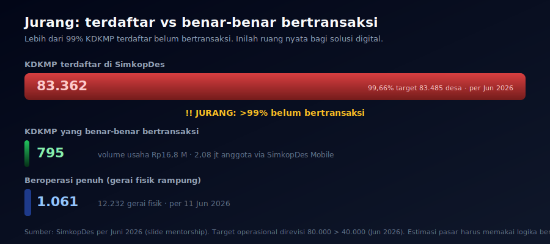
</div>

> [!IMPORTANT]
> **Hanya ~1% KDKMP yang benar-benar bertransaksi.** Inilah ruang nyata bagi TemuNiaga: menjadikan Kopdes transisi dari *"terdaftar"* ke *"hidup"* dengan mesin ekonomi operasional.

---

### B. Kriteria Juri & Format Pitch

<div align="center">
  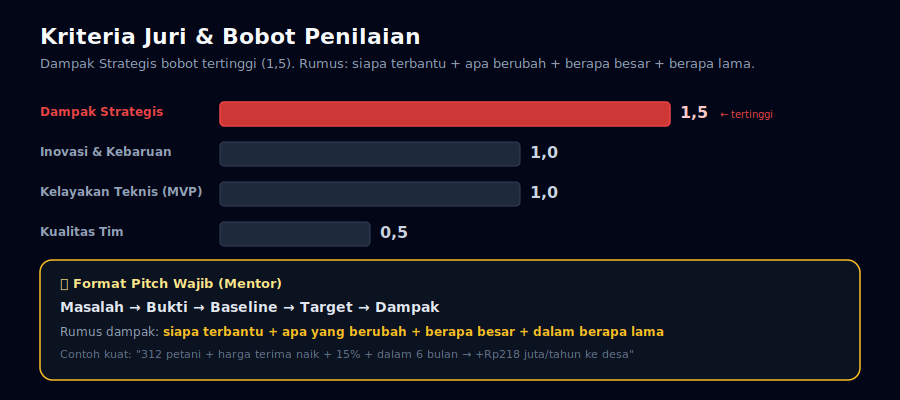
</div>

**Rumus dampak TemuNiaga (mengikuti format mentor):**

| Komoditas | Baseline | Target | Petani | Dampak/tahun | Waktu |
|---|---|---|---|---|---|
| **Kopi** (hero pitch) | Rp6.000/kg | Rp6.900/kg (+15%) | 500 × 800 kg/th | **+Rp360 juta/th** | 6 bln |
| **Beras** | Rp6.925/kg | Rp7.133/kg (+3%) | 1.000 × 2.000 kg/th | **+Rp416 juta/th** | 12 bln |
| **Singkong** | Rp1.350/kg | Rp1.500/kg (+11%) | 300 × 5.000 kg/th | **+Rp225 juta/th** | 6 bln |

> Penekanan pitch deck: **kopi** — dampak +15% paling meyakinkan.

---

### C. TAM · SAM · SOM

<div align="center">
  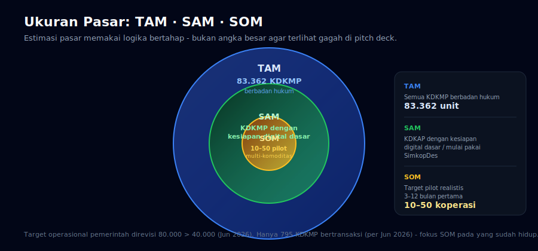
</div>

---

### D. Value Proposition Canvas

<div align="center">
  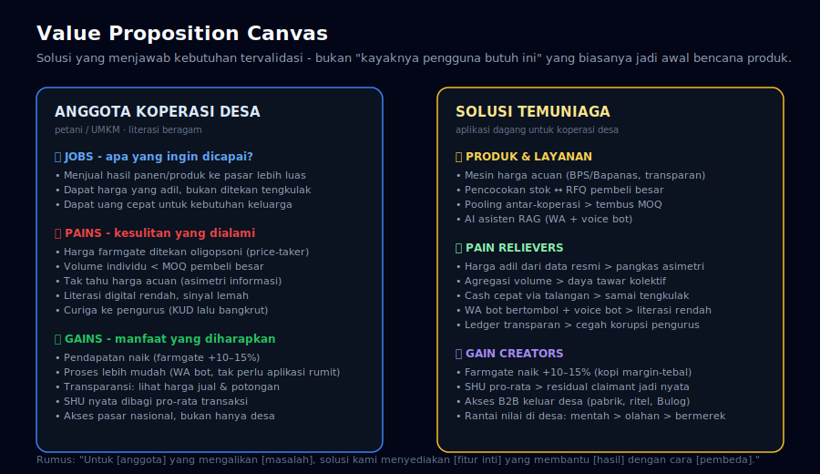
</div>

> **Rumus:** *"Untuk anggota koperasi desa yang kesulitan mengakses pasar dan mendapat harga adil, solusi kami menyediakan platform dagang yang mencatat transaksi, mencocokkan permintaan-stok, dan membuka akses pembeli besar secara transparan dengan harga dari data resmi."*

---

### E. Asisten AI: RAG Scoped + Voice Bot

| Komponen | Detail |
|---|---|
| **Teknologi** | LLM + RAG (Retrieval-Augmented Generation) atas data sendiri — bukan LLM free-form |
| **Data grounding** | Ledger transaksi, harga acuan BPS/Bapanas, status setoran, SHU |
| **Scope** | Hanya topik yang punya data — "berapa harga kopi hari ini?" → DB → jawab. Di luar scope → "hubungi operator" |
| **Anti-halusinasi** | Setiap jawaban bisa ditelusuri ke baris data — near-zero halusinasi |
| **Voice bot** | STT → Intent → RAG → LLM → TTS. Untuk petani sangat kuno yang tak bisa baca/tekan tombol |
| **Otomasi tiket** | ~70–80% pertanyaan repetitif dijawab otomatis, sisanya eskalasi ke operator |
| **Integrasi** | WhatsApp (Baileys) + voice note. Keduanya **live di MVP** |

> [!TIP]
> **Kenapa bukan AI bebas?** Karena juri akan langsung tanya: *"Gimana kalau AI-nya ngaco? Gimana kalau ngasih harga salah dan petani dirugikan?"* RAG scoped adalah jawabannya: setiap jawaban dari data, setiap jawaban bisa diaudit. Near-zero halusinasi bukan janji — ini properti sistem.

---

### F. Model Bisnis Produk

| Stream | Siapa bayar | Besaran |
|---|---|---|
| **Gratis untuk Kopdes kecil** | — | Rp0 (adopsi cepat, jawab inklusivitas) |
| **Transaction fee B2B** | Pembeli / Kopdes matang | % kecil dari margin deal yang berhasil dicocokkan |
| **Premium analytics (fase 2)** | Koperasi sekunder / pembeli besar | SaaS fee untuk dashboard pasar, prediksi tren |

> **Mengapa hybrid:** Kopdes kecil gratis onboarding → memutus pola KUD bergantung subsidi. Transaction fee self-sustaining (makin banyak jual, makin untung kedua pihak). Fee dipotong dari margin deal, **bukan dari kantong Kopdes kecil**.

---

### G. Empat Analisis PEBS FEB UI

<div align="center">
  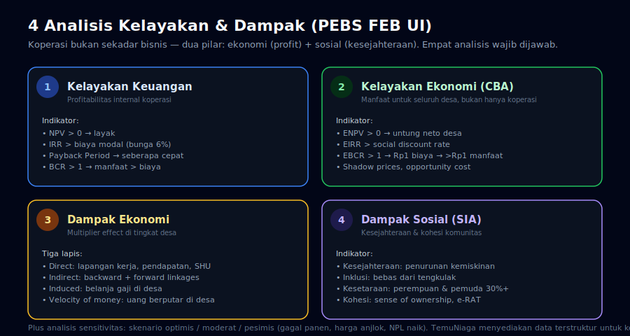
</div>

**Peran TemuNiaga:** menyediakan **data terstruktur** (ledger, harga, keanggotaan) yang menjadi **input** untuk keempat analisis di atas. TemuNiaga tidak menggantikan analisis — TemuNiaga menyediakan data yang membuat analisis memungkinkan.

---

### H. Benchmark Global

<div align="center">
  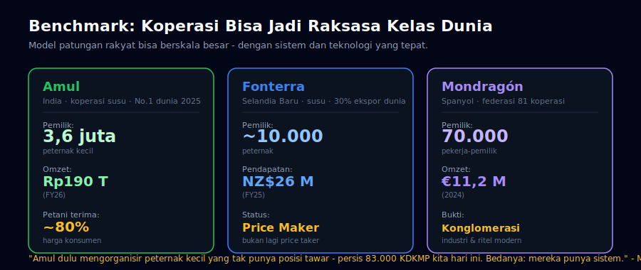
</div>

---

### I. Empat Jebakan Klasik (dan jawaban TemuNiaga)

| Jebakan | Status TemuNiaga |
|---|---|
| **1. Solusi mencari masalah** | ✅ Aman — masalah oligopsoni + farmer's share dulu, software penunjang |
| **2. Overclaim tanpa baseline** | ✅ Aman — baseline & target eksplisit per komoditas, batas dinyatakan terbuka |
| **3. Abai inklusivitas** | ✅ Aman — WA bot bertombol + voice bot + operator jembatan manusia |
| **4. Tidak skalabel di desa** | ✅ Aman — multi-tenant, modular, SOM 10-50 → skalasi bertahap |

---

### J. Indikator Dampak 4 Dimensi

| Dimensi | Indikator | Sumber Data |
|---|---|---|
| **Ekonomi** | Volume usaha, pendapatan, efisiensi | SimkopDes / ledger TemuNiaga |
| **Partisipasi** | Anggota aktif baru, keterlibatan digital | Data keanggotaan, log penggunaan |
| **Inklusi** | Akses pembiayaan, literasi keuangan | Survei pengguna, data simpan pinjam |
| **Keberlanjutan** | Retensi pengguna, skalabilitas | Data adopsi, studi replikasi |

---

### K. Visi Ekosistem Data Nasional

> *Satu Data Indonesia → Dashboard Lintas Kementerian & Daerah → Koperasi Digital (TemuNiaga)*

TemuNiaga bukan aplikasi terpisah — ia adalah **fondasi data transaksi dan keanggotaan di level paling dasar** yang interoperable dengan Simkopdes dan Satu Data Indonesia. Struktur data rapi, bisa diaudit, format konsisten, keamanan data bawaan — bukan hiasan slide.

---

### L. Struktur Pitch Deck Final (11 Slide)

```
1. Masalah (795/83.000, oligopsoni, farmer's share 32%)
2. Bukti dari data (sumber resmi, baseline per komoditas)
3. Solusi & value proposition (TemuNiaga = mesin ekonomi)
4. Cara kerja (alur 11 langkah, 3 aktor, 4 fungsi + AI voice bot)
5. Dampak terukur (baseline → target per komoditas, format mentor)
6. Pasar: TAM / SAM / SOM
7. Model bisnis (hybrid freemium + transaction fee)
8. Strategi implementasi (pilot → evaluasi → skalasi)
9. Risiko & mitigasi (R1–R12 + 4 jebakan)
10. Tim
11. Visi: ekosistem data nasional + benchmark Amul
```

---

### M. Catatan Sejarah KUD & Pelajaran

- Baru **~35% koperasi aktif** rutin menggelar RAT (basis akuntabilitas)
- KUD era lalu banyak **runtuh karena subsidi + tata kelola lemah**
- TemuNiaga dirancang untuk **memutus pola lama**: ledger transparan (bukan RAT formalitas), SHU pro-rata (bukan ditahan), AI grounded data (bukan mengira-ngira), model bisnis mandiri (bukan subsidi)

<div align="center">
  <p><sub><strong>TemuNiaga</strong> • Disiapkan untuk Hackathon Digital Cooperatives Expo 2026 · Pilar 3</sub><br/>
  <sub>Kementerian Koperasi RI × PEBS FEB Universitas Indonesia</sub><br/>
  <sub><em>Temu penjual & pembeli · Niaga desa ke pasar nasional</em></sub></p>
</div>
